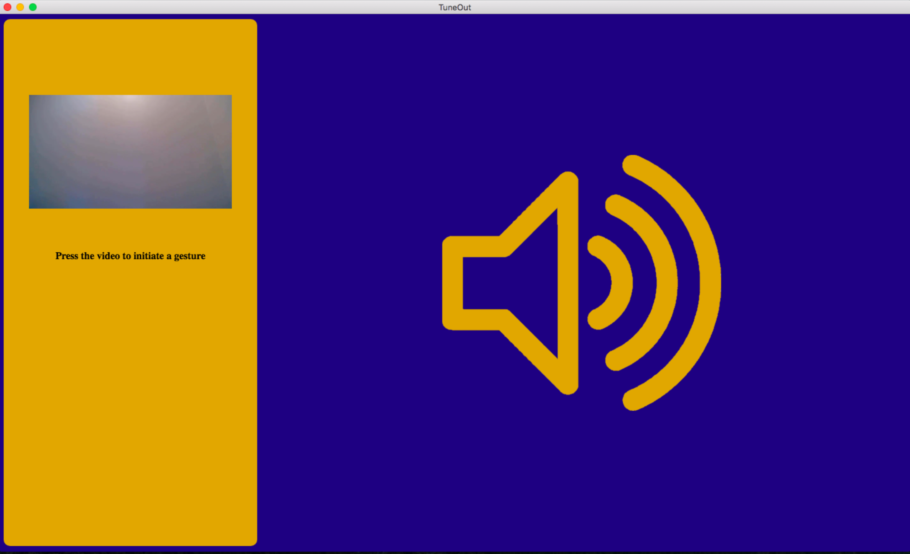

# Gesture-Recognition-Techniques

> - A collection of two icon selection techniques that are used to control the volume of an audio player.

---

## Installation

> 1. Go [to GitHub](https://github.com/electron/fiddle/releases/tag/v0.15.1) and download [Electron Fiddle](https://www.electronjs.org/)
> 2. You will need to install [NodeJS](https://nodejs.org/en/download/) (LTS Version) - I use v14.15.3

**LTS** - Long Term Support

---

## Run

> 1. Download the repository files (unzip if necessary)
> 2. If you are on **Windows 10**, open a new **PowerShell**. If you are on a **Mac**, open up your **Command Line (terminal shell)**.
> 3. In your shell, navigate to your unzipped folder and type:

```bash
npm install --save electron
```

> Once your install is successful, there should be a bunch of files inside the "node_modules" folder

```bash
npm start .
```

> 
